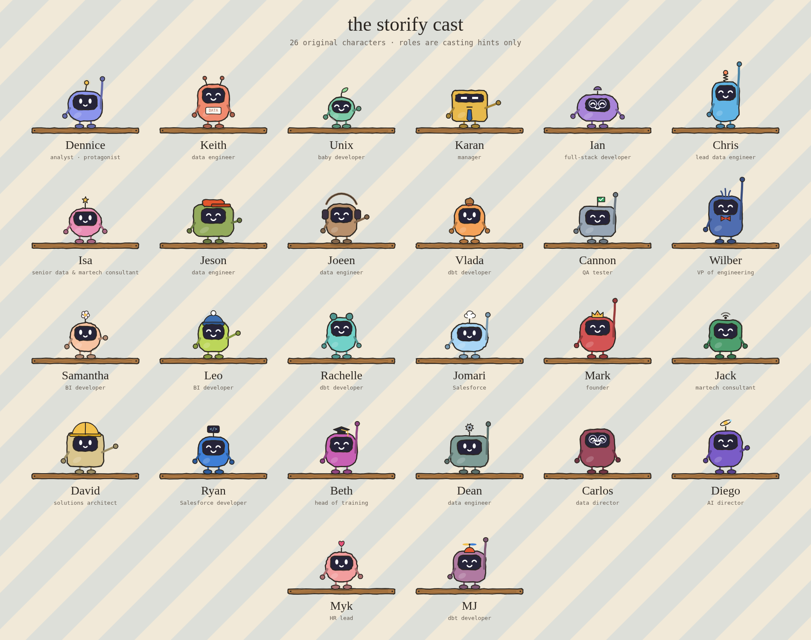

# Storify — Animated Story Films Skill for Claude

A **Claude skill** that turns a scenario, case study or knowledge base into a short, **hand-drawn animated explainer film** starring an original cast of robot characters. Every frame is drawn in JavaScript on a canvas, with procedural music and sound, so the film is one self-contained file — no video editor, no stock assets, no API keys.

Give it a story in plain English. It works out what *kind* of story it is, how many characters it needs, and which facts must appear on screen — then builds a film that directs the viewer's eye, tells a real story, and ends with a recap.



---

## What is this?

Most "explainer animation" prompts produce a slideshow with motion. Storify is built around what actually makes a lesson stick:

- **It tells a story, not a list.** Before writing any code it classifies your story (before-and-after, how-it-works, problem-and-fix, comparison, cautionary tale, lessons learned) and uses the matching arc — And-But-Therefore, a turning point, a clear ending.
- **It directs attention.** One idea per beat, a camera that frames the speaker and what they're acting on, a vignette on everything else, and speech bubbles that never cover the focal point.
- **It stays accurate.** A *facts ledger* is built from your source first; only those numbers and claims may appear on screen.
- **It looks consistent.** Every film shares one "sketchbook diorama" style — jittered double-stroked lines, a 6 fps line boil, paper texture — and one cast.

### Outputs

| Output | What you get |
|---|---|
| 🎞️ **HTML file** | One self-contained `.html` film with an interactive player (click-through by default, autoplay optional) |
| 🔗 **Artifact** | The same film published as a shareable page (Claude app only) |
| 📹 **MP4** | A 1920×1080, 30 fps video with the soundtrack, rendered frame-by-frame — for slides, an LMS or social posts |

---

## How the skill is built

```
storify/
├── .claude-plugin/
│   ├── plugin.json            # plugin manifest
│   └── marketplace.json       # makes this repo a single-plugin marketplace
├── SKILL.md                   # the workflow + all reference code (the "brain")
└── examples/
    ├── regulatory-report-film.html   # a complete film built with the skill
    ├── cast-reel.html                # every character, animated
    └── cast-sheet.png                # cast reference sheet
```

`SKILL.md` is a workflow, not a prompt. It walks Claude through:

1. **Outputs** — which of HTML / artifact / MP4 to make (checkboxes).
2. **Story** — paste it or attach it: a scenario, a case study, or a knowledge base.
3. **Analysis** — source kind, story type, cast size, facts ledger and a beat-by-beat outline, shown to you before anything is built.
4. **Build** — from tested reference code (sketch helpers, the character drawer for the whole roster, speech bubbles, the player state machine, the MP4 capture hook).
5. **Check** — renders frames across every chapter and fixes overlaps, clipped text and wrong numbers.
6. **Deliver** — each chosen output.

### The cast

26 original robot characters share one construction, sketch style, set of moods and poses — so any subset of them belongs in the same world. Each has a **role hint** (analyst, data engineer, manager, QA tester…) used only for *casting*: when your story has a QA tester, the QA tester robot plays them. Role hints are never shown on screen unless the story needs them. A film uses 1 character by default and at most 4.

Open [`examples/cast-reel.html`](examples/cast-reel.html) in a browser to meet them.

---

## Requirements

- **[Claude Code](https://docs.claude.com/en/docs/claude-code)** (CLI, desktop, or IDE extension) — or the Claude app, where the artifact output is also available.
- **For HTML / artifact output:** nothing else.
- **For MP4 output:** Node.js, [Playwright](https://playwright.dev) with Chromium, and `ffmpeg` on the machine where Claude runs.
- **Optional fonts:** the films use *Patrick Hand* and *IBM Plex Mono* from Google Fonts. For MP4 renders on an offline machine, put the `.ttf` files in a folder and pass it to the renderer (`fontDir`); otherwise a fallback font is used.

---

## Installation

Two ways to install. The **plugin** method is the easiest (managed, updatable); the **manual** method drops the skill straight into your skills folder.

### Method 1 — Plugin (recommended)

This repo doubles as a single-plugin Claude Code marketplace. Inside Claude Code:

```
/plugin marketplace add keith-fajardo/storify
/plugin install storify@storify
```

- `storify@storify` = `<plugin-name>@<marketplace-name>` (both are `storify` here).
- To update later: `/plugin marketplace update storify`, then reinstall.

When installed this way the skill is **namespaced** — invoke it as `/storify:storify`.

### Method 2 — Manual (git clone into your skills folder)

A skill is just a folder containing `SKILL.md`. Clone it where Claude Code looks for skills.

**Personal** (available in every project):

```bash
git clone https://github.com/keith-fajardo/storify.git ~/.claude/skills/storify
```

**Project** (checked into one repo, shared with its team):

```bash
git clone https://github.com/keith-fajardo/storify.git .claude/skills/storify
```

Installed this way, invoke it as plain `/storify`.

### Verify

Start (or restart) a Claude Code session and run:

```
/storify          # manual install
/storify:storify  # plugin install
```

Claude should ask which outputs you want, then ask for your story. If the skill doesn't appear:
- **Manual:** confirm `SKILL.md` sits directly at `~/.claude/skills/storify/SKILL.md`, then restart.
- **Plugin:** re-check the marketplace was added (`/plugin marketplace list`), then reinstall.

---

## Usage

Invoke with `/storify` (or `/storify:storify` for a plugin install). With no arguments, Claude asks for the outputs and the story. Arguments skip the matching question:

| Argument | Values | Effect |
|---|---|---|
| `outputs=` | `html`, `artifact`, `mp4` (comma-separated) | skips the output question |
| `type=` | `before-after`, `how-it-works`, `problem-fix`, `comparison`, `cautionary`, `lessons` | forces the story type |
| `characters=` | `1`–`4` | forces the cast size |
| `mode=` | `click` (default) or `auto` | starting playback mode |
| `title="…"` | text | forces the film's title |

Anything after the arguments, or any attached file, is the story.

```
/storify
/storify outputs=html,mp4 -- A business analyst spent 65 minutes a month on a regulatory report in chat...
/storify type=how-it-works characters=2 -- <paste your pipeline runbook>
/storify outputs=mp4 mode=auto title="Why we test dbt models" -- <attach a case study>
```

### Watching a film

- **Click-through (default):** each beat plays, then waits. Click, tap, or press → / Space to continue; ← goes back.
- **Autoplay:** toggle it in the player; beats advance on their own. Space pauses and resumes.
- The player also has a scrubber, a speed button (0.75×–1.5×) and a sound toggle.

---

## Example

[`examples/regulatory-report-film.html`](examples/regulatory-report-film.html) — a before-and-after story: an analyst's monthly regulatory report takes 65 minutes a session in chat (with errors caught every month), then gets rebuilt on a Project, knowledge base, Skill and Code Execution and drops to 30 minutes with verification still running and zero errors. Download it and open it in a browser to click through it beat by beat.

---

## Credit

Created by [Keith Fajardo](https://github.com/keith-fajardo). Storytelling approach draws on Mayer's principles of multimedia learning, classic animation staging, the And-But-Therefore structure and the Pixar story spine. The characters are original; the skill never draws real brands' logos or mascots.
